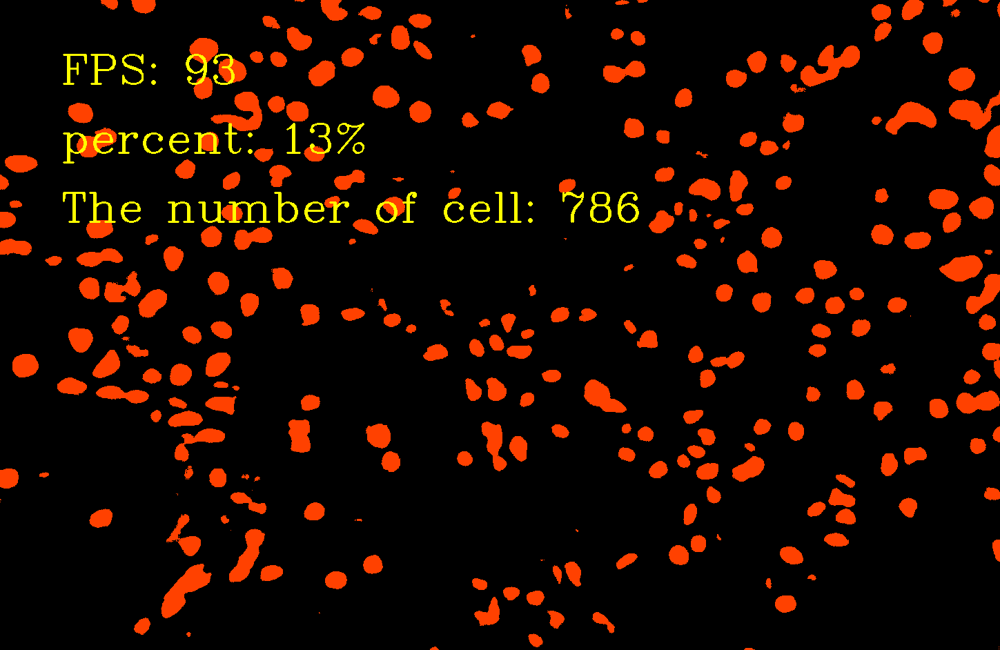

# 1. 环境安装

## 1.1 opencv

运行exe（其实是解压），将压缩包解压到相应目录，如：`C:\Program Files (x86)\opencv`
在系统变量 Path 的末尾添加：`C:\Program Files (x86)\opencv\build\x64\vc15\bin`


**VS2017中配置OpenCV**

- 打开vs2017，新建立一个空的项目，在菜单栏中点击【视图】[属性管理器]，这时候右边会出现一个属性管理器工作区来。

- 工程中右击–>属性

- 包含目录 配置：VC++目录—>包含目录：

  `D:\opencv\build\include ；`
  `D:\opencv\build\include\opencv；`
  `D:\opencv\build\include\opencv2`

- 库目录 配置：VC++目录—>库目录：
  D:\opencv\build\x64\vc15\lib
  注意：（1）此处的x64表示电脑是64位，32位选择x86
  （2）vc10表示VS是2010，vc11对应VS2012，vc12对应VS2013，vc14对应VS2015 ,vc15对应VS2017

- 链接器 配置：

  链接器–>输入–>附加依赖项
  opencv_world341.lib 注意release里面
  opencv_world341d.lib 注意，这是在debug里，不能混用，不然会闪退的

## 1.2  cmake安装

解压`cmake-3.23.0-rc3-windows-x86_64.zip` 到当前文件夹

## 1.3 TensorRT安装

- 将`TensorRT-8.2.1.8.Windows10.x86_64.cuda-11.4.cudnn8.2.zip`解压后，将lib路径添加到Path环境变量中；
- 将TensorRT解压位置\lib下的dll文件复制到C:\Program Files\NVIDIA GPU Computing Toolkit\CUDA\v11.1\bin目录下;\lib的lib文件复制到C:\Program Files\NVIDIA GPU Computing Toolkit\CUDA\v11.1\lib中；\include文件夹复制到C:\Program Files\NVIDIA GPU Computing Toolkit\CUDA\v11.1\include中。
- 测试示例代码。在D:\MyWorkSpace\Lib\TensorRT-8.2.1.8\samples\sampleMNIST下运行代码；
- 配置vs2017项目属性
  a.将E:\tensorrt_tar\TensorRT-8.2.1.8\lib加入 项目->属性->VC++目录–>可执行文件目录
  b.将E:\tensorrt_tar\TensorRT-8.2.1.8\lib加入 VC++目录–>库目录
  c. 将E:\tensorrt_tar\TensorRT-8.2.1.8\include加入C/C++ --> 常规 --> 附加包含目录
  d.将nvinfer.lib、nvinfer_plugin.lib、nvonnxparser.lib和nvparsers.lib加入链接器–>输入–>附加
- 用cmd进入TensorRT-xxxx\data\mnist 目录，执行python download_pgms.py，下载测试数据；
- 进入TensorRT-xxxx\bin，用cmd执行sample_mnist.exe --datadir=d:\path\to\TensorRT-xxxxx\data\mnist\

## 1.4 安装VS2017

- 下载vs2017，选择c++和python的开发工具
- 添加环境变量：在变量Path中，新增cl.exe的全路径，我的全路径是“C:\Program Files (x86)\Microsoft Visual Studio\2017\Enterprise\VC\Tools\MSVC\14.16.27023\bin\Hostx64\x64\cl.exe”
  

 ## 1.5 安装CUDA和cudnn

到CUDA官网下载CUDA，除自动添加的path外，添加新的path

```
CUDA_PATH=C:\Program Files\NVIDIA GPU Computing Toolkit\CUDA\v11.1
CUDA_SDK_PATH = C:\ProgramData\NVIDIA Corporation\CUDA Samples\v11.1
CUDA_LIB_PATH = %CUDA_PATH%\lib\x64
CUDA_BIN_PATH = %CUDA_PATH%\bin
CUDA_SDK_BIN_PATH = %CUDA_SDK_PATH%\bin\win64
CUDA_SDK_LIB_PATH =%CUDA_SDK_PATH%\common\lib\x64
```

下载cudnn，解压后，将.h .lib 和.dll 文件分别拷贝到cuda的include, lib/x64, bin 文件夹下

## 1.6 安装pycuda

> pip install pycuda

测试代码

```python
import pycuda.autoinit
import pycuda.driver as drv
import numpy

from pycuda.compiler import SourceModule
mod = SourceModule("""
__global__ void multiply_them(float *dest, float *a, float *b)
{
  const int i = threadIdx.x;
  dest[i] = a[i] * b[i];
}
""")

multiply_them = mod.get_function("multiply_them")

a = numpy.random.randn(400).astype(numpy.float32)
b = numpy.random.randn(400).astype(numpy.float32)

dest = numpy.zeros_like(a)
multiply_them(
        drv.Out(dest), drv.In(a), drv.In(b),
        block=(400,1,1), grid=(1,1))

print ( dest-a*b )
```

## 1.7 安装python

**conda create -n medicalSeg python=3.7**

在medicalSeg这个虚拟环境下，安装下面的python库：

- torch>=1.10

* torchvision

* segmentation_models_pytorch

* scipy

* opencv

* numpy

* skimage

* labelme

* torch2trt

  


# 2. 模型训练及量化

'python train.py'
'python trt.py'

训练完成后，在./checkpoints文件夹下会产生model_trt.engine

# 3. 动态库使用示例

```c++
#include <iostream>
#include <thread>
#include "seg_lib.h"
#pragma comment(lib, "seg_lib.lib")

int main(int arcgc, char** argv) {
	const std::string engine_file_path = argv[1];
	const std::string input_video_path = argv[2];

	SEG* MySeg=GetSeg(engine_file_path, input_video_path);
	MySeg->GetCount();
	MySeg->GetPercent();
	MySeg->Prediction();
	MySeg->GetCount();
	MySeg->GetPercent();


	std::cout << "done....." << std::endl;
	return 0;
};
```


